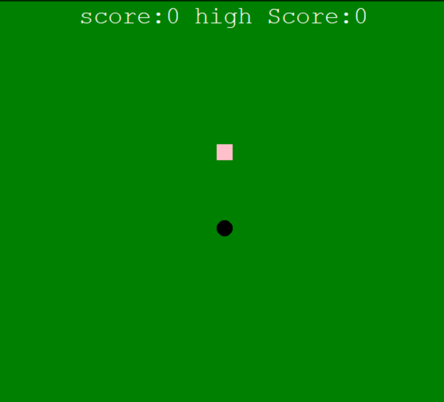
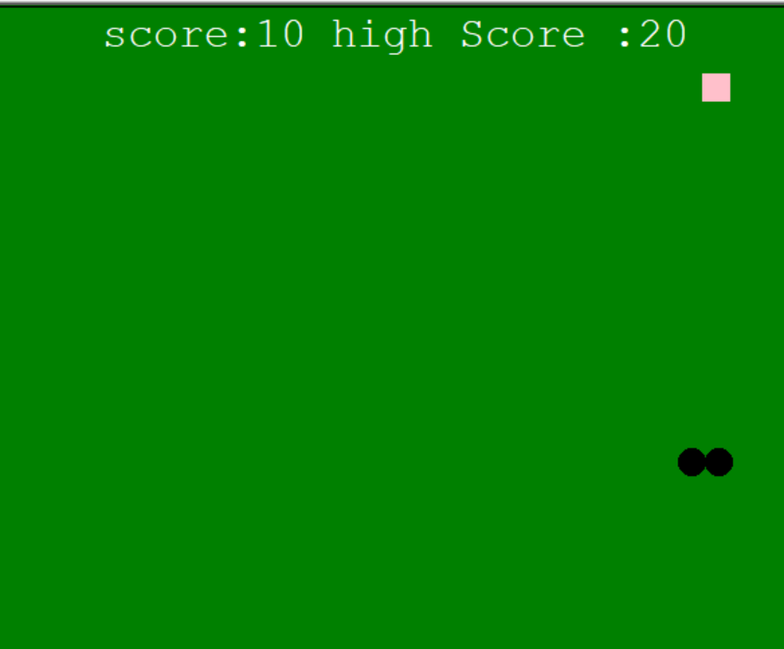
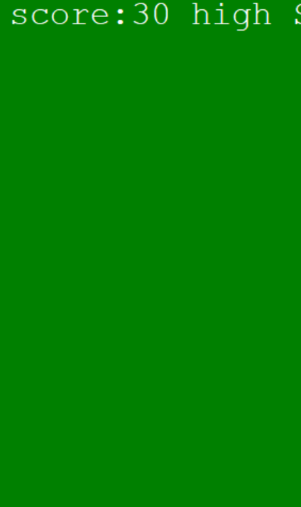

# 🐍 Snake Game (Python)

A python-based snake game using real-time keyboard input, grid movement system, collision detection, and score tracking.

---

## 🎮 Game Screenshots

### Gameplay Screen 1


### Gameplay Screen 2


### Gameplay Screen 3


---

## ✨ Features
- Real-time keyboard control
- Grid-based movement system
- Food generation
- Collision detection
- Score tracking system
- Game over detection

---

## 🧠 Technologies Used
- Python
- Pygame library

---

## 🚀 How to Run the Game

```bash
pip install pygame
python snake\ game.py
